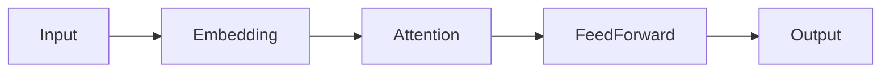

# Research Note Template

Hello world.

# Research Note

## Metadata

| Field    | Value                     |
| -------- | ------------------------- |
| Paper    | Attention Is All You Need |
| Authors  | Vaswani et al.            |
| Year     | 2017                      |
| Venue    | NeurIPS                   |
| Status   | Reading                   |
| Priority | High                      |

---

## Executive Summary

The paper proposes the Transformer architecture, replacing recurrent and convolutional structures with self-attention mechanisms.

Key contribution:

* Self-attention based sequence modeling
* Parallelizable training
* Improved long-range dependency modeling

---

## Key Findings

### Finding 1

Self-attention allows direct interaction between any two tokens.

### Finding 2

Training is significantly more parallelizable than RNN-based approaches.

### Finding 3

Performance improves on machine translation benchmarks.

---

## Important Quotes

> The dominant sequence transduction models are based on complex recurrent or convolutional neural networks.

> Attention mechanisms have become an integral part of compelling sequence modeling.

---

## Strengths

* Simpler architecture
* Faster training
* Strong empirical results
* Scales effectively

---

## Weaknesses

* Quadratic attention cost
* Memory intensive
* Original paper evaluated mainly on translation

---

## Questions

* Why does self-attention work so well?
* What happens for very long sequences?
* How does attention compare to recurrence theoretically?

---

## Related Papers

| Paper | Relation                    |
| ----- | --------------------------- |
| BERT  | Uses Transformer encoder    |
| GPT   | Uses Transformer decoder    |
| T5    | Encoder-decoder Transformer |
| ViT   | Transformer for vision      |

---

## Reading Checklist

* [x] Title
* [x] Abstract
* [x] Introduction
* [ ] Methodology
* [ ] Experiments
* [ ] Limitations
* [ ] References

---

## Code Notes

```python
class SelfAttention(nn.Module):
    def __init__(self):
        super().__init__()

    def forward(self, x):
        return x
```

---

## Mermaid Diagram



---

## Footnote Test

Transformer architectures have become the foundation of modern NLP.[^1]

[^1]: This note exists only to test footnote rendering.

---

## Definition List

Term
: Self-attention mechanism used to relate tokens.

Transformer
: Neural architecture based primarily on attention.

---

## Collapsible Section

<details>
<summary>Implementation Notes</summary>

This content should remain hidden until expanded.

Useful for:

* Long explanations
* Configuration notes
* Experimental observations

</details>

---

## References

1. Vaswani et al. (2017)
2. Devlin et al. (2018)
3. Brown et al. (2020)
